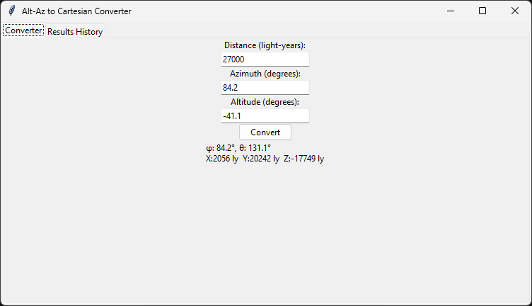
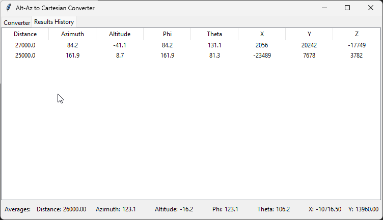

# SphericalConverter

A quick little Python GUI tool for converting celestial spherical coordinates (distance, azimuth, altitude) into Cartesian (x, y, z) coordinates.

## Screenshots

<div style="display: flex; gap: 20px; justify-content: center; align-items: flex-start;">
  <div style="text-align: center; flex: 1;">
    
    <p><strong>Converter Tab</strong><br/>Enter distance, azimuth, and altitude to convert spherical coordinates to Cartesian</p>
  </div>
  <div style="text-align: center; flex: 1;">
    
    <p><strong>Results History Tab</strong><br/>View all conversions and calculate averages</p>
  </div>
</div>

## How It Works

The tool uses spherical coordinate transformation to convert:
- **Distance (r)**: Distance in light-years
- **Azimuth (φ)**: Horizontal angle in degrees (0–360°, measured from north)
- **Altitude (θ)**: Vertical angle in degrees (−90° to +90°, where 0° is horizon, 90° is zenith)

Into Cartesian coordinates:
- **X, Y, Z**: Position in light-years using standard spherical-to-Cartesian math

## Requirements

- Python 3.6+
- tkinter (usually included with Python)

## Installation

1. Clone or download this repository:
```bash
git clone https://github.com/yourusername/SphericalConverter.git
```

## Usage

Run the GUI:
```bash
python celestialSphericalToCartesian.py
```

### Converter Tab
1. Enter a **Distance** (in light-years)
2. Enter an **Azimuth** (0–360 degrees)
3. Enter an **Altitude** (−90 to +90 degrees)
4. Click **Convert**
5. View the result (Cartesian coordinates + spherical angles)

### Results History Tab
- View all conversions in a table
- See **Averages** footer showing per-column means
- Click **Refresh Averages** to manually recalculate if needed

## Example

**Input:**
- Distance: 100 ly
- Azimuth: 45°
- Altitude: 30°

**Output:**
- φ: 45.0°, θ: 60.0°
- X: 61 ly, Y: 61 ly, Z: 50 ly

## Technical Details

The conversion uses:
```
θ = 90° − altitude
φ = azimuth

x = r × sin(θ) × cos(φ)
y = r × sin(θ) × sin(φ)
z = r × cos(θ)
```

## Author

Brandon Erquicia

## Contributing

Contributions welcome! Feel free to open an issue or submit a pull request.